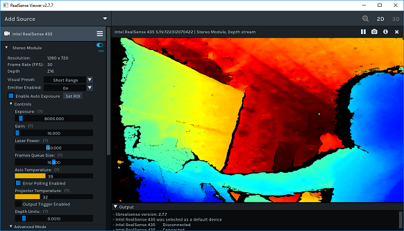
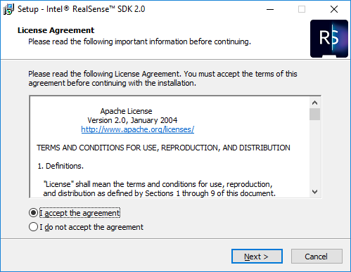
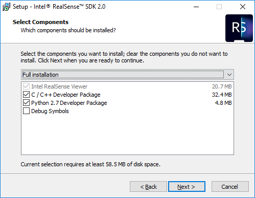
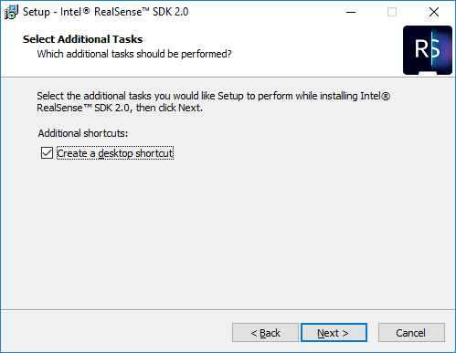
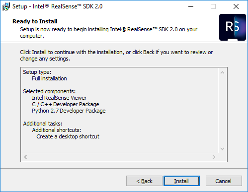
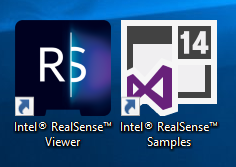
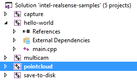

# Windows Distribution

**Intel® RealSense™ SDK 2.0** provides tools and binaries for the Windows platform using [GitHub Releases](https://github.com/IntelRealSense/librealsense/releases)

> To build from source, please follow the steps described [here](./installation_windows.md)

After plugging the camera into a USB3 port, you should be able to see the newly connected device in the Device Manager: 

## Intel RealSense Viewer

- Go to the [latest stable release](https://github.com/IntelRealSense/librealsense/releases/latest), navigate to the **Downloads** section, download and run **Intel.RealSense.Viewer.Portable.exe**:

- Explore the depth data:

## Installing the SDK

* Go to the [latest stable release](https://github.com/IntelRealSense/librealsense/releases/latest), navigate to the **Downloads** section, download and run **Intel.RealSense.SDK.exe**:

* Click through several simple steps of the installer:
1. Intel® RealSense™ SDK 2.0 is distributed under the [Apache 2.0](../LICENSE) permissive open-source license:

2.  The SDK includes the RealSense Viewer, as well as development packages for various programming languages:

3. Approve adding two shortcuts to your desktop:

 

4. Review before installing:

5. Open the `Intel® RealSense™ Samples`solution:

6. Press `F5` to compile and run the demos:

7. Success!
